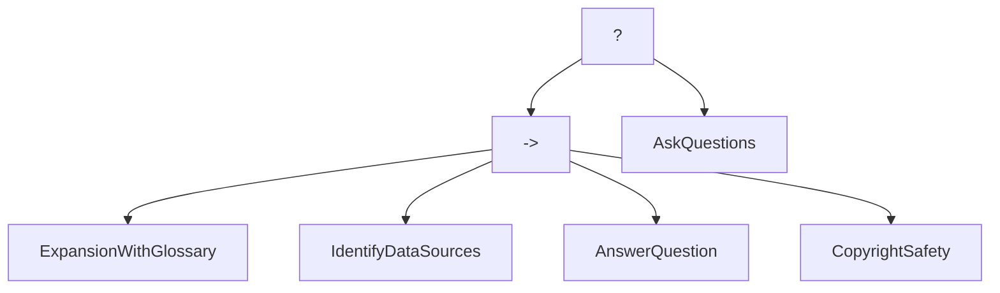

# ABT
Agentic Behavior Trees

```mermaid
graph TD
    2061488094544[?] --> 2061485182736[->]
    2061485182736[->] --> 2061485432400[ExpansionWithGlossary]
    2061485182736[->] --> 2061485427472[IdentifyDataSources]
    2061485182736[->] --> 2061488129744[AnswerQuestion]
    2061485182736[->] --> 2061488130256[CopyrightSafety]
    2061488094544[?] --> 2061488130768[AskQuestions]
```
