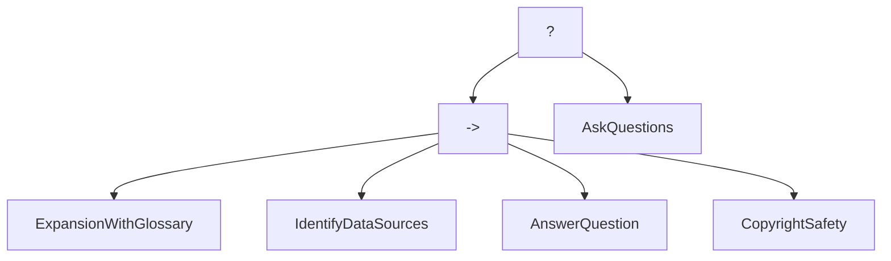

# ABT - Agentic Behavior Trees

[](https://github.com/cxbxmxcx/Agentic-Behavior-Trees/stargazers)
[](https://opensource.org/licenses/MIT)
[](https://www.python.org/downloads/)

> Featured in the book [AI Agents In Action](https://www.manning.com/books/ai-agents-in-action) by Micheal Lanham

An open-source framework for building and orchestrating complex agent workflows using behavior trees. ABT provides a structured approach to creating multi-agent systems with sophisticated decision-making capabilities.

## Introduction to Behavior Trees

Behavior trees are a powerful pattern originally developed for robotics and game AI. First introduced by Rodney A. Brooks in 1986, they provide a structured way to control complex, autonomous systems using a hierarchical tree of nodes.

Unlike other AI control systems, behavior trees operate on the principle of success and failure. Each node in the tree executes and returns either success or failure, which determines the flow of execution through the tree. The execution flows from top to bottom and left to right, with behavior determined by the type of nodes and their arrangement.

### Core Components of Behavior Trees



Behavior trees consist of several key node types:

| Node Type | Symbol | Purpose | Function |
|-----------|--------|---------|----------|
| Selector (Fallback) | ? | Selects the first child that succeeds | Calls children in sequence until one succeeds |
| Sequence | → | Executes all children in order | Calls each child in sequence until one fails or all succeed |
| Condition | - | Checks if a condition is true | Returns success if the condition is true, failure otherwise |
| Action | - | Performs a specific action | Executes and returns success if successful, failure otherwise |
| Decorator | - | Controls execution of child nodes | Can modify, filter, or limit the execution of its child |

### Why Agentic Behavior Trees?

Agentic Behavior Trees combines the power of behavior trees with LLM-powered agents to create robust, flexible AI systems. This approach offers several significant advantages:

1. **Modularity and Reusability**: Behavior trees promote a modular approach, allowing you to create reusable components that can be shared across different parts of your agent system.

2. **Scalability**: As systems grow in complexity, behavior trees gracefully handle the addition of new behaviors, making them ideal for sophisticated multi-agent systems.

3. **Flexibility and Extensibility**: New nodes (actions, conditions, decorators) can be added without drastically altering the existing structure, making it easy to extend agent capabilities.

4. **Debugging and Visualization**: Behavior trees provide clear visual representations of behaviors, which is beneficial for debugging and understanding the decision-making process.

5. **Decoupling of Decision Logic**: They separate decision-making from execution logic, promoting a clear distinction between high-level strategy and low-level actions.

Compared to other AI control systems like Finite State Machines, Decision Trees, or Rule-Based Systems, behavior trees offer superior organization and scalability for complex agent interactions, particularly when working with LLM-powered agents.

## Features

- 🌲 Behavior tree-based orchestration for complex agent workflows
- 🤖 Support for multiple LLM providers including OpenAI and Azure OpenAI
- 🧠 Shared blackboard architecture for inter-agent communication
- 🔄 Flexible node types including Sequences, Selectors, and Actions
- 📋 Built-in conversation management with tracking and history
- 🛠️ Tool-calling support for LLM function execution
- 📊 Mermaid diagram visualization of behavior trees
- 🚀 Simple yet powerful API for defining agent behaviors

## Installation

```bash
# Clone the repository
git clone https://github.com/cxbxmxcx/Agentic-Behavior-Trees.git
cd Agentic-Behavior-Trees

# Install dependencies
pip install -r requirements.txt

# Create .env file from sample
cp sample.env .env
```

Then open the `.env` file and add your API keys according to the provider you're using (OpenAI or Azure OpenAI).

## Quick Start

### Basic Usage

```python
from agentic_ai import Agent, agent_action
from agentic_btrees import create_agent_node
import py_trees
from agentic_blackboard import initialize_blackboard
from agentic_conversation import run_conversation_loop

# Initialize your agent
agent = Agent("my_agent")

# Create the behavior tree root
root = py_trees.composites.Selector("RootSelector", memory=True)

# Initialize the blackboard
initialize_blackboard(root, {})

# Create a sequence node for ordered operations
sequence = py_trees.composites.Sequence("MainSequence", memory=True)
root.add_child(sequence)

# Add agent nodes to the sequence
answer_node = create_agent_node(
    name="AnswerQuestion",
    agent=agent,
    agent_instructions="""
    Answer the user's question thoughtfully.
    Question: {{question}}
    """,
    input_keys=["question"]
)
sequence.add_child(answer_node)

# Create a behavior tree
tree = py_trees.trees.BehaviourTree(root)

# Run the conversation loop
run_conversation_loop(tree, root)
```

### Using Tools with Agents

```python
from agentic_ai import Agent, agent_action

# Define tool functions with the agent_action decorator
@agent_action
def get_weather(location: str, unit: str = "celsius"):
    """Get the current weather for a location."""
    # Implementation code here
    return f"The weather in {location} is sunny and 22 degrees {unit}."

# Create your agent
agent = Agent("weather_agent")

# Add the tool to your agent
agent.add_tool(get_weather)

# Ask the agent a question
response = agent.ask_agent("What's the weather like in New York?")
print(response["content"])
```

## Advanced Usage

### Creating Complex Behavior Trees

You can create sophisticated agent workflows by combining different node types:

- **Selector nodes** (`?`): Try each child in order until one succeeds
- **Sequence nodes** (`->`): Execute all children in order until one fails
- **Action nodes**: Perform specific agent actions or tasks

```python
# Create a more complex tree
root = py_trees.composites.Selector("RootSelector", memory=True)

# Main sequence for the happy path
main_sequence = py_trees.composites.Sequence("MainSequence", memory=True)
root.add_child(main_sequence)

# Add steps to the main sequence
main_sequence.add_child(create_agent_node(
    name="UnderstandQuery",
    agent=agent,
    agent_instructions="Analyze and understand the user query: {{question}}",
    input_keys=["question"]
))

main_sequence.add_child(create_agent_node(
    name="ResearchAnswer",
    agent=agent,
    agent_instructions="Research the answer to: {{question}}",
    input_keys=["question"]
))

main_sequence.add_child(create_agent_node(
    name="FormulateResponse",
    agent=agent,
    agent_instructions="Formulate a comprehensive response to: {{question}}",
    input_keys=["question"]
))

# Fallback sequence for when main sequence fails
fallback = create_agent_node(
    name="RequestClarification",
    agent=agent,
    agent_instructions="Request clarification for: {{question}}",
    input_keys=["question"]
)
root.add_child(fallback)
```

### Visualizing Behavior Trees

You can visualize your behavior trees using the built-in Mermaid diagram generator:

```python
import mermaid

# Generate a Mermaid diagram of your tree
diagram = mermaid.tree_to_mermaid(root)
print(diagram)
```


## Configuration

### Environment Variables

Create a `.env` file based on the `sample.env` template:

```
# For OpenAI
API_TYPE=openai
OPENAI_API_KEY=your_openai_api_key

# For Azure OpenAI
API_TYPE=azure
OPENAI_API_KEY=your_azure_openai_api_key
OPENAI_API_ENDPOINT=your_azure_endpoint
OPENAI_API_VERSION=your_api_version
OPENAI_API_DEPLOYMENT=your_deployment_name
```

## Contributing

Contributions are welcome! Please feel free to submit a Pull Request.

1. Fork the repository
2. Create your feature branch (`git checkout -b feature/amazing-feature`)
3. Commit your changes (`git commit -m 'Add some amazing feature'`)
4. Push to the branch (`git push origin feature/amazing-feature`)
5. Open a Pull Request

## License

This project is licensed under the MIT License - see the [LICENSE](LICENSE) file for details.

## How Behavior Trees Execute

Understanding how behavior trees execute is crucial to designing effective agent systems:

1. Execution flows from top to bottom and left to right through the tree
2. Each node returns either success or failure
3. Node types determine how execution proceeds:
   - **Selector/Fallback nodes** try each child in sequence until one succeeds
   - **Sequence nodes** execute all children in order until one fails
   - **Condition nodes** check if a condition is true and return success or failure
   - **Action nodes** perform specific actions and return success or failure based on outcome

This execution model creates a robust decision-making framework that can handle complex, hierarchical agent behaviors with natural fallback mechanisms.

## Learning More

For a comprehensive guide to using behavior trees with AI agents, check out the book [AI Agents In Action](https://www.manning.com/books/ai-agents-in-action) by Micheal Lanham. The book covers behavior trees in depth along with other agent orchestration techniques.

## Keywords

agent orchestration, multi-agent systems, behavior trees, LLM agents, AI agents, agent workflows, autonomous agents, decision trees, agent frameworks, conversational AI, generative AI, reactive planning, agent cooperation, autonomous decision-making, AI Agents In Action