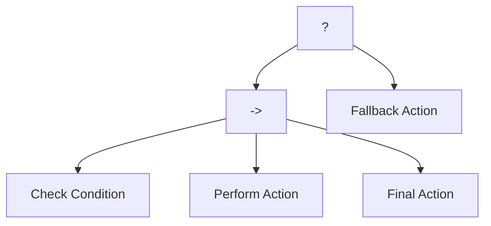
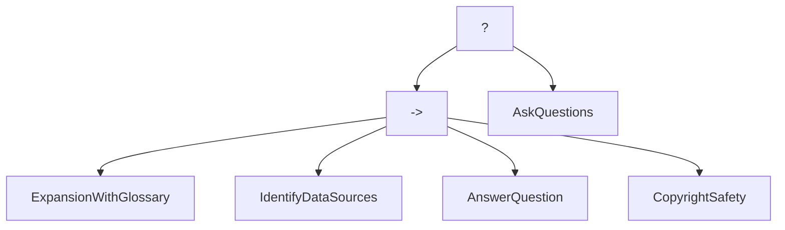

# Orchestrating AI Agents with Behavior Trees: The Missing Piece in Agent Architectures

In the rapidly evolving landscape of AI agents, we're witnessing an explosion of frameworks, platforms, and approaches. From simple chatbots to complex multi-agent systems, organizations are increasingly turning to AI agents to automate tasks, enhance productivity, and create new user experiences. However, as these agent systems grow in complexity, a critical challenge emerges: how do we effectively orchestrate multiple agents working together on complex tasks?

Most current agentic platforms focus on individual agent capabilities—improving reasoning, knowledge retrieval, or tool usage—but fall short when it comes to orchestrating multiple agents in complex workflows. The result is often a collection of powerful but disconnected agents that lack the coordination and fallback mechanisms needed for robust real-world applications. This orchestration gap represents one of the biggest barriers to creating truly effective multi-agent systems.

## Behavior Trees: A Proven Pattern for AI Orchestration

Behavior Trees offer a powerful solution to this orchestration challenge. Originally developed for robotics and game AI, behavior trees have a rich history dating back to Rodney A. Brooks' seminal 1986 paper, "A Robust Layered Control System for a Mobile Robot." They've been battle-tested for decades in complex environments like video games, where they control the behavior of non-player characters (NPCs).

What makes behavior trees particularly well-suited for AI agent orchestration? Unlike other control systems such as finite state machines or simple rule-based approaches, behavior trees operate on the principle of success and failure. Each node in the tree executes and returns either success or failure, which determines the flow of execution. This creates a natural fallback mechanism, where if one approach fails, the system can automatically try alternative approaches.

Here's a simple visualization of a behavior tree structure:



Behavior trees consist of several key node types, each serving a specific purpose in the orchestration flow:
- **Selector nodes** (often called fallback nodes) try each child in sequence until one succeeds
- **Sequence nodes** execute all children in order until one fails
- **Action nodes** perform specific tasks and return success or failure
- **Condition nodes** check if a condition is true and return success or failure

This hierarchical structure allows for building complex decision-making systems that remain maintainable and understandable, even as they scale to dozens or hundreds of nodes. The clear visual representation also makes debugging and improvement easier compared to other approaches.

## Agentic Behavior Trees: A Framework for Orchestrating LLM Agents

The [Agentic Behavior Trees](https://github.com/cxbxmxcx/Agentic-Behavior-Trees) (ABT) framework brings these proven orchestration patterns to the world of LLM-powered agents. This open-source project provides a structured approach to creating multi-agent systems with sophisticated decision-making capabilities, built on top of the robust py_trees library.

At its core, ABT provides a simple yet powerful API for defining agent behaviors within a behavior tree structure. Here's a simplified example of how you might create a basic agent node:

```python
from agentic_ai import Agent
from agentic_btrees import create_agent_node
import py_trees

# Initialize your agent
agent = Agent("research_agent")

# Create a node for the agent in the behavior tree
research_node = create_agent_node(
    name="ResearchTopic",
    agent=agent,
    agent_instructions="""
    Research the topic thoroughly and provide detailed information.
    Topic: {{topic}}
    Return FAILURE if you cannot find sufficient information.
    """,
    input_keys=["topic"]
)
```

The framework handles the complexity of integrating LLM agents with behavior trees, allowing developers to focus on designing effective workflows rather than building orchestration systems from scratch. ABT includes support for shared blackboard architecture for inter-agent communication, built-in conversation management, and automatic visualization of behavior trees using Mermaid diagrams.

Here's a visualization of a simple question-answering behavior tree from the repository:



## Managing Complex AI Agent Orchestrations

The true power of ABT becomes apparent when building complex multi-agent workflows. Let's examine a more sophisticated example that demonstrates a conversational workflow with multiple specialized agents working together:

```python
# Create the root node (selector)
root = py_trees.composites.Selector("RootSelector", memory=True)

# Create the main sequence for the happy path
sequence_node = py_trees.composites.Sequence("MainSequence", memory=True)
root.add_child(sequence_node)

# Initialize the shared blackboard
initialize_blackboard(root, {})

# Add specialized agent nodes to the sequence
expansion_node = create_agent_node(
    name="ExpansionWithGlossary",
    agent=expansion_agent,
    agent_instructions="""
    Expand the question with a glossary of terms.
    Return FAILURE if you cannot expand the question.
    Question: {{question}}
    """,
    input_keys=["question"]
)
sequence_node.add_child(expansion_node)

research_node = create_agent_node(
    name="IdentifyDataSources",
    agent=research_agent,
    agent_instructions="""    
    Identify the data sources for the question.
    Return FAILURE if you cannot identify the data sources.
    Question: {{question}}
    """,
    input_keys=["question"]
)
sequence_node.add_child(research_node)

answer_node = create_agent_node(
    name="AnswerQuestion",
    agent=answer_agent,
    agent_instructions="""    
    Answer the question based on the identified data sources.
    Return FAILURE if you cannot answer the question.
    Question: {{question}}
    """,
    input_keys=["question"]
)
sequence_node.add_child(answer_node)

# Add a fallback node for when the main sequence fails
clarification_node = create_agent_node(
    name="AskClarification",
    agent=clarification_agent,
    agent_instructions="""    
    Ask clarifying questions to help answer the user's query.
    Question: {{question}}
    """,
    input_keys=["question"]
)
root.add_child(clarification_node)
```

This example demonstrates several key advantages of behavior trees for agent orchestration:

1. **Natural fallback mechanisms**: If any node in the main sequence fails (returns FAILURE), the tree automatically falls back to the clarification node. This creates resilient systems that gracefully handle edge cases.

2. **Specialized agents**: Different parts of the workflow can use different agents optimized for specific tasks, rather than trying to build a single "do everything" agent.

3. **Sequential processing**: The sequence node ensures that steps happen in the correct order—first expanding the question, then identifying data sources, and finally answering the question.

4. **Shared context**: All agents in the tree can access the same blackboard, allowing information discovered by one agent to be used by others in the workflow.

## Conclusion: The Future of Agent Orchestration

Agentic Behavior Trees provide a powerful pattern for building complex, resilient agent systems that can tackle real-world problems. By combining the flexibility of LLM agents with the structured decision-making of behavior trees, developers can create sophisticated workflows that gracefully handle edge cases and coordinate multiple specialized agents. The modular nature of behavior trees also allows for incremental development and testing, making it easier to build and refine complex agent systems over time.

For those interested in exploring this approach in more depth, my book [AI Agents In Action](https://www.manning.com/books/ai-agents-in-action) covers behavior trees and many other patterns for agent orchestration. The book provides a comprehensive framework for designing, building, and deploying sophisticated agent systems, with detailed examples and practical guidance for real-world applications. Combined with the open-source ABT framework, these resources offer a powerful toolkit for anyone looking to build the next generation of intelligent agent systems.